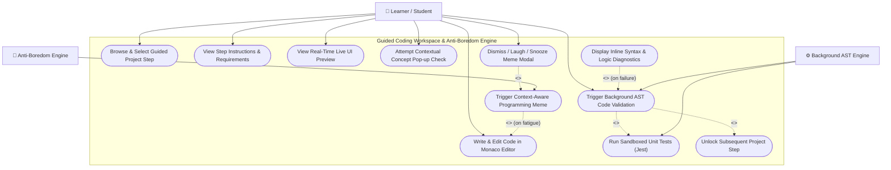
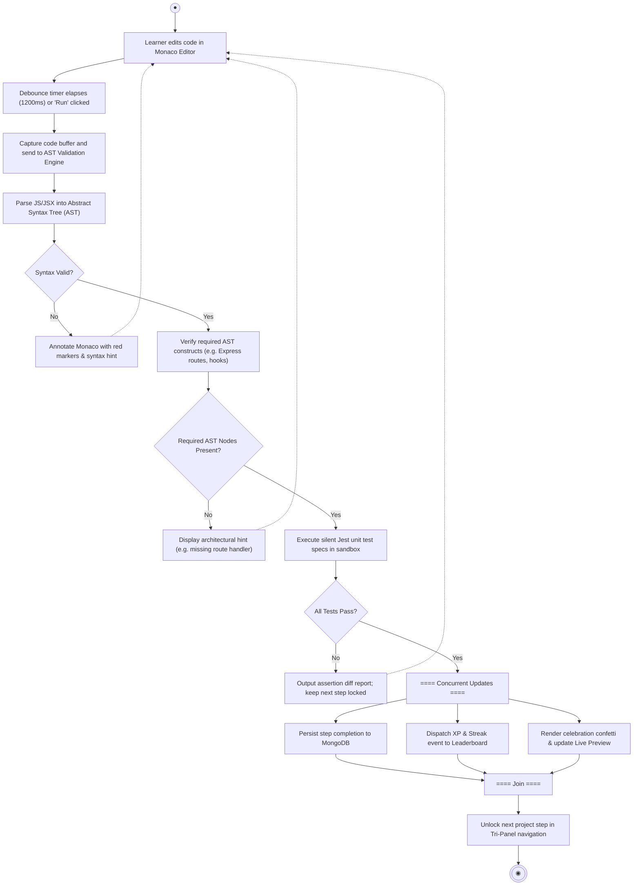
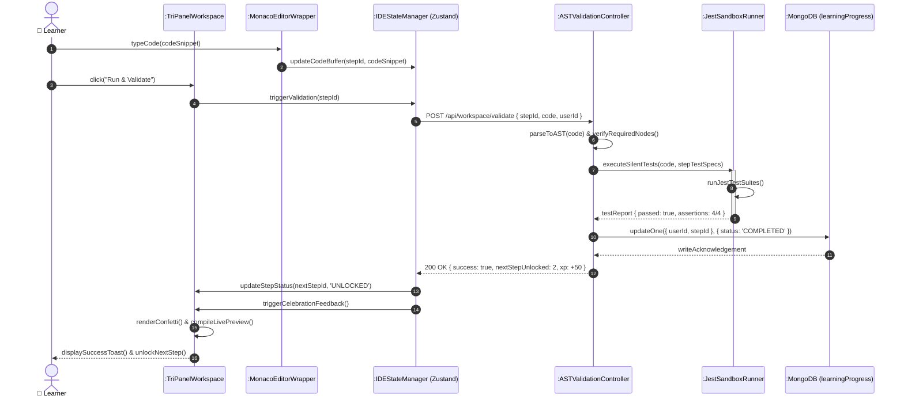
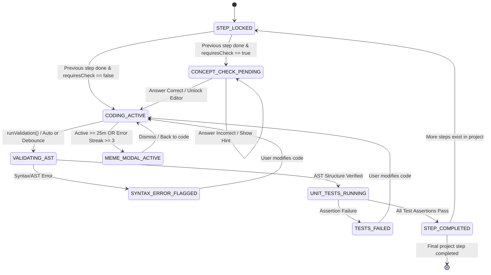

# UML Specification & Architectural Design
## Feature 01: The Guided Coding Workspace & Anti-Boredom Engine
**Student:** Gunasekara M.I.T. (`244068K`)  
**Module:** Guided Tri-Panel IDE, Monaco Editor, Real-Time AST Validation & Meme Engine  
**Project:** DevCraft (IN2901 - Team DoD)  

---

## 📂 Generated Draw.io Files

All diagrams have been generated in native **Draw.io (`.drawio`) format** inside [`docs/diagrams/`](file:///e:/Documents/UoM/Sem3/IN2901/Project%20Proposals/IDE/docs/diagrams/):

| Diagram Type | Filename | Description |
| :--- | :--- | :--- |
| **All-in-One Multi-Page** | [DevCraft_Feature01_Guided_Workspace_All_UML.drawio](file:///e:/Documents/UoM/Sem3/IN2901/Project%20Proposals/IDE/docs/diagrams/DevCraft_Feature01_Guided_Workspace_All_UML.drawio) | Complete 7-page Draw.io workbook containing all diagrams in tabbed pages. |
| **Use Case Diagram** | [use_case_workspace.drawio](file:///e:/Documents/UoM/Sem3/IN2901/Project%20Proposals/IDE/docs/diagrams/use_case_workspace.drawio) | Subsystem boundaries, user interactions, `<<include>>` and `<<extend>>` cases. |
| **Activity: Validation** | [activity_ast_validation.drawio](file:///e:/Documents/UoM/Sem3/IN2901/Project%20Proposals/IDE/docs/diagrams/activity_ast_validation.drawio) | Code submission, AST parsing, silent Jest unit testing, and progressive step unlocking. |
| **Activity: Memes & Checks** | [activity_meme_and_check.drawio](file:///e:/Documents/UoM/Sem3/IN2901/Project%20Proposals/IDE/docs/diagrams/activity_meme_and_check.drawio) | Swimlane workflow for contextual theory gatekeeper check and session fatigue meme trigger. |
| **Sequence: Validation** | [sequence_ast_validation.drawio](file:///e:/Documents/UoM/Sem3/IN2901/Project%20Proposals/IDE/docs/diagrams/sequence_ast_validation.drawio) | Interaction sequence between Monaco, Zustand store, AST engine, Jest runner, and MongoDB. |
| **Sequence: Memes & Checks** | [sequence_meme_and_check.drawio](file:///e:/Documents/UoM/Sem3/IN2901/Project%20Proposals/IDE/docs/diagrams/sequence_meme_and_check.drawio) | Sequence for prerequisite checkpoints and background fatigue activity triggers. |
| **Design Class Diagram (DCD)** | [class_diagram_workspace.drawio](file:///e:/Documents/UoM/Sem3/IN2901/Project%20Proposals/IDE/docs/diagrams/class_diagram_workspace.drawio) | Object-oriented design showing React components, Zustand state, services, and Mongoose schemas. |
| **State Machine Diagram** | [state_machine_step_lifecycle.drawio](file:///e:/Documents/UoM/Sem3/IN2901/Project%20Proposals/IDE/docs/diagrams/state_machine_step_lifecycle.drawio) | Statechart of project steps from `STEP_LOCKED` to `VALIDATING_AST` to `STEP_COMPLETED`. |

---

## 1. Subsystem Use Case Diagram

### Purpose
Models how the learner interacts with the Guided Workspace, highlighting automated background services (`AST Validation Engine`, `Anti-Boredom Engine`) and extension points for diagnostics and memes.

---

## 2. Activity Diagram: AST Validation & Progressive Step Unlocking

### Purpose
Details the operational flow from user typing to AST parsing, structural validation, sandboxed Jest unit testing, and concurrent step unlocks with XP/streak events.

---

## 3. Sequence Diagram: Real-Time AST Validation & Step Progression

### Purpose
Depicts the asynchronous request-reply lifelines between the React frontend, client state manager, backend Express controller, test sandbox, and database.

---

## 4. State Machine Diagram: Project Step Lifecycle & IDE States

### Purpose
Exhibits the strict state progression of guided project steps, ensuring learners cannot bypass unverified code blocks or complex concepts without validation.

---

## 5. Design Class Diagram (DCD): Guided Workspace Architecture

### Class Details & Component Responsibilities
* **`IDEWorkspace`**: Top-level Tri-Panel grid layout managing panel dimensions and state synchronizations.
* **`InstructionsPanel`**: Renders markdown instructions, step objectives, and collapsible progressive hints.
* **`MonacoEditorWrapper`**: Integrates Microsoft Monaco Editor API with custom themes, syntax highlighting, and inline diagnostic markers.
* **`LivePreviewRenderer`**: Manages sandboxed iframe compilation for live MERN UI previews.
* **`ContextualCheckModal`**: Modal dialog blocking the editor until prerequisite theoretical questions are answered.
* **`MemePopupManager`**: Monitors session activity, keystrokes, and consecutive errors to trigger anti-burnout memes.
* **`IDEStateManager`**: Zustand/Redux centralized store handling code buffers, validation states, and step navigation.
* **`ASTValidationService`**: Backend AST parsing service using Babel/Bespoke parser to verify structural integrity.
* **`JestSandboxRunner`**: Isolated worker executing unit tests safely with strict timeouts.
* **`ProjectStepModel` & `LearningProgressModel`**: Mongoose data schemas for project steps and individual student learning tracks.
